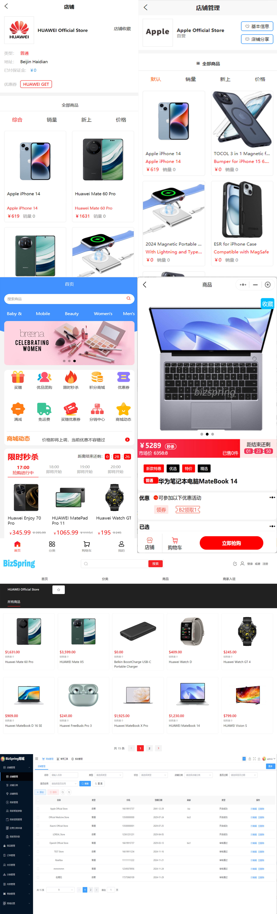
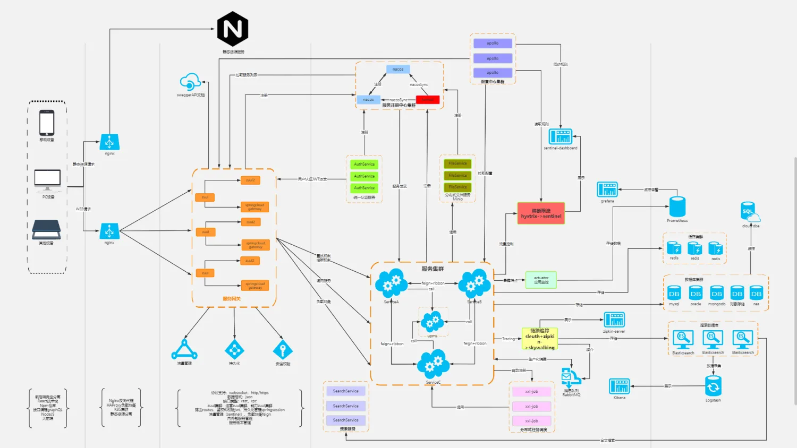

BizSpring商城是基于SpringCloud核心技术构建的微服务开源商城系统。不仅适用于电商平台，也支持多用户商城模式，能够满足不同规模企业的需求。通过采用分布式架构设计，BizSpring商城提供了高可用性、易扩展性和良好的性能表现，非常适合现代电子商务环境下的应用需求。  
	该平台集成了Spring Cloud框架下多种成熟的技术组件和服务治理方案，如服务发现、配置中心、智能路由等，确保了系统的稳定运行与灵活扩展。此外，BizSpring商城还支持模块化开发，可以根据实际业务需要快速定制和部署新功能或服务，极大地提高了开发效率。  
	对于希望构建自己的在线零售平台的企业来说，BizSpring商城提供了一个强大的起点，我们结合了先进的技术栈与丰富的电商功能，包括但不限于商品管理、订单处理、会员体系等核心能力。无论是初创公司还是大型企业，都可以利用这个开放源代码项目来加速其数字化转型进程，并且根据自身特定要求进行二次开发以实现更高级别的定制化服务。

## 开源文档
[http://docs.bizspring.cn](http://docs.bizspring.cn)

## BizSpring开源项<font style="color:rgb(64, 72, 91);">目链接</font>
#### Github
数据库（微服务商城）

[https://github.com/bizspring-mall/BizSpring-Web-Mall](https://github.com/bizspring-mall/BizSpring-Web-Mall)[.git](https://github.com/bizspring-mall/BizSpring-Cross-Border-Mall.git)

VUE3页面（跨境电商）

[https://github.com/bizspring-mall/BizSpring-Cross-Border-Mall.git](https://github.com/bizspring-mall/BizSpring-Cross-Border-Mall.git)

微服务后台（Java商城）

[https://github.com/bizspring-open/BizSpring-Java-Mall.git](https://github.com/bizspring-open/BizSpring-Java-Mall.git)

移动商城

[https://github.com/bizspring-code/BizSpring-Mobile-Mall.git](https://github.com/bizspring-code/BizSpring-Mobile-Mall.git)

小程序商城

[https://github.com/bizspring-code/BizSpring-Applet-Mall.git](https://github.com/bizspring-code/BizSpring-Applet-Mall.git)

微服务商城

[https://github.com/bizspring-open/BizSpring-Cloud-Mall](https://github.com/bizspring-open/BizSpring-Cloud-Mall)[.git](https://github.com/bizspring-code/BizSpring-Applet-Mall.git)

#### Gitee
数据库（微服务商城）

[https://gitee.com/bizSpring_mall/BizSpring-Cloud-Mall.git](https://gitee.com/bizSpring_mall/BizSpring-Cloud-Mall.git)

VUE3页面（跨境电商）

[https://gitee.com/BizSpringOpen/BizSpring-Cross-Border-Mall.git](https://gitee.com/BizSpringOpen/BizSpring-Cross-Border-Mall.git)

微服务后台（Java商城）

[https://gitee.com/bizSpring_mall/bizspring-java-mall.git](https://gitee.com/bizSpring_mall/bizspring-java-mall.git)

移动商城

[https://gitee.com/BizSpring-Source-Code/BizSpring-Mobile-Mall.git](https://gitee.com/BizSpring-Source-Code/BizSpring-Mobile-Mall.git)

小程序商城

[https://gitee.com/BizSpring-Source-Code/BizSpring-Applet-Mall.git](https://gitee.com/BizSpring-Source-Code/BizSpring-Applet-Mall.git)

## <font style="color:rgb(64, 72, 91);">系统展示</font>


# 体验地址
| 系统 | H5二维码 | APP下载 | H5 URL | PC URL |
| --- | --- | --- | --- | --- |
| 商城 |  |   | [https://shop.bizspring.cn/shop/#](https://shop.bizspring.cn/shop/#) | [https://shop.bizspring.cn/pc/#](https://shop.bizspring.cn/pc/#) |
| 商家 |  |  | [https://shop.bizspring.cn/merchant/#](https://shop.bizspring.cn/merchant/#) | [https://shop.bizspring.cn/biz/#](https://shop.bizspring.cn/biz/#) |
| 管理 | [https://shop.bizspring.cn](https://shop.bizspring.cn) |  | [https://shop.bizspring.cn](https://shop.bizspring.cn) | [https://shop.bizspring.cn](https://shop.bizspring.cn) |


### 开源文档
[http://docs.bizspring.cn](http://docs.bizspring.cn)

## <font style="color:rgb(64, 72, 91);">授权</font>
<font style="color:rgb(64, 72, 91);">除开源版本外，本商城还提供商业版本的商城，欲知详情，请访问官网。</font>

<font style="color:rgb(64, 72, 91);">商城官网：</font>[<font style="color:rgb(9, 94, 171);">https://www.bizspring.c</font>](https://gitee.com/link?target=https%3A%2F%2Fwww.mall4j.com)<font style="color:rgb(9, 94, 171);">n</font>

<font style="color:rgb(64, 72, 91);">商城使用 AGPLv3 开源，请遵守 AGPLv3 的相关条款.</font>

<font style="color:rgb(64, 72, 91);"></font>

# <font style="color:rgb(60, 60, 67);">微服务架构</font>
<font style="color:rgb(60, 60, 67);">不同于传统的单体服务，微服务架构是一种将应用程序分为多个小型、独立的服务的软件架构。这些服务可以通过轻量级通信机制进行通信，每个服务都有自己的数据库和应用程序代码，每个服务运行在自己的进程中。这种模式使得每个服务可以独立部署、扩展和维护，从而提高应用程序的可靠性，这种架构可以更好地支持快速迭代和部署，提高开发效率和灵活性。</font>



## <font style="color:rgb(64, 72, 91);">系统核心框架</font>
| 名称 | 框架 |
| --- | --- |
| 核心框架 | spring boot、spring cloud、spring cloud alibaba |
| 注册中心 | nacos |
| 负载均衡 | Spring Cloud Load balancer |
| 服务调用: | open feign |
| 服务容错: | Alibaba sentinel |
| api网关 | spring cloud gateway |
| 分布式事务: | seata |
| 持久层框架 | MyBatis-plus |
| 高性能缓存 | redis redisson |
| 文件管理 | Alibaba oss |
| SMS短信 | Alibaba SMS |
| 安全 | oauth2+jwt |
| 数据库 | mysql8+ |
| API管理 | swagger |
| 搜索引擎 | elasticsearch |
| JDK版本 | Java8+ |
| PC端前段框架 | vue3+elementPlus |
| 商家框架 | Uniapp+vue(一套代码多平台发布) |
| 商城框架 | Uniapp+vue(一套代码多平台发布) |


## 系统服务架构
<font style="color:rgb(64, 72, 91);">本项目是一个极度遵守阿里巴巴代码规约的项目，以下是</font><font style="color:rgb(64, 72, 91);">商城部署后 API 说明</font>

| **<font style="color:rgb(64, 72, 91);">服务</font>** | **<font style="color:rgb(64, 72, 91);">服务说明</font>** |
| :--- | :--- |
| <font style="color:rgb(64, 72, 91);">ElasticSearch</font> | <font style="color:rgb(64, 72, 91);">搜索引擎服务</font> |
| <font style="color:rgb(64, 72, 91);">bizspring-module-nacos</font> | <font style="color:#000000;">Nacos 服务</font> |
| <font style="color:rgb(64, 72, 91);">bizspring-module-gatway </font> | <font style="color:rgb(64, 72, 91);">网管服务</font> |
| <font style="color:rgb(64, 72, 91);">bizspring-auth </font> | <font style="color:rgb(64, 72, 91);">授权校验服务</font> |
| <font style="color:rgb(64, 72, 91);">bizspring-upms </font> | <font style="color:rgb(64, 72, 91);">用户基础服务</font> |
| <font style="color:rgb(64, 72, 91);">bizspring-marketing </font> | <font style="color:rgb(64, 72, 91);">营销服务</font> |
| <font style="color:rgb(64, 72, 91);">bizspring-order </font> | <font style="color:rgb(64, 72, 91);">订单服务</font> |
| <font style="color:rgb(64, 72, 91);">bizspring-store </font> | <font style="color:rgb(64, 72, 91);">店铺服务</font> |
| <font style="color:rgb(64, 72, 91);">bizspring-goods </font> | <font style="color:rgb(64, 72, 91);">商品服务</font> |


## <font style="color:rgb(64, 72, 91);">代码目录结构</font>
本项目严格遵循了阿里巴巴的代码规约，确保了代码的质量、可读性和维护性。以保证每一行代码都符合阿里巴巴制定的最佳实践标准.

1. **命名规范**：所有变量、函数、类等命名均采用了有意义且易于理解的名字，并按照阿里编码指南中的推荐格式进行书写。
2. **注释与文档**：重要逻辑部分均有清晰的注释说明；公共方法和类提供了详尽的Javadoc或等效文档描述。
3. **代码结构**：保持了良好的模块化设计，每个文件只负责单一功能，避免了冗长复杂的单个文件出现。
4. **异常处理**：对于可能出现错误的情况，实现了适当的异常捕获机制，并给出了合理的错误信息反馈。
5. **性能优化**：尽量减少了不必要的资源消耗，比如避免了循环中重复计算等常见问题。
6. **安全性考量**：特别注意了数据验证和安全漏洞防护，如SQL注入攻击防范等 。 同时大部分现有代码已经很好地达到了高质量的标准。未来，我们将持续关注这些指标，不断优化和完善我们的软件开发流程，以提供更加稳定可靠的产品给用户。

```plain
# 项目结构说明书
BizSpring
├── 5.bizspring-admin-vue3/  //管理平台-前端vue
│   ├── public/  //公共文件夹
│   │   └── config.js  //后台服务URL配置接口
│   ├── src/
│   │   ├── api/  //管理平台vue接口文件夹
│   │   │   ├── gen/  //代码生成API包
│   │   │   ├── goods/  //商品管理API包
│   │   │   ├── marketing/  //促销管理API包
│   │   │   ├── order/  //订单管理API包
│   │   │   ├── store/  //店铺管理API包
│   │   │   ├── upms/  //平台管理API包
│   │   │   └── login.js  //登录API接口
│   │   ├── assets/  //资源文件夹
│   │   ├── components/  //组件文件夹
│   │   ├── const/  //平台管理页面数据配置
│   │   ├── page/  //框架页面文件夹
│   │   │   ├── index/  //主页文件夹
│   │   │   └── login/  //登录文件夹
│   │   ├── router/  //路由包
│   │   ├── store/  //vue store包
│   │   ├── styles/  //主页主题相关
│   │   ├── utils/  //工具类
│   │   ├── views/  //页面文件夹
│   │   │   ├── goods/  //商品页面文件夹
│   │   │   ├── marketing/  //促销页面文件夹
│   │   │   ├── order/  //订单页面文件夹
│   │   │   ├── store/  //店铺页面文件夹
│   │   │   ├── tool/  //代码生成页面文件夹
│   │   │   └── upms/  //平台管理页面文件夹
│   │   ├── App.vue
│   │   └── main.js
│   ├── package.json
│   └── vite.config.js
│
├── 6.bizspring-java/  //Java服务端
│   ├── bizspring-base/  //公共包
│   │   ├── bizspring-base-core/  //核心公共包
│   │   ├── bizspring-base-data/  //数据公共包
│   │   ├── bizspring-base-datasource/  //数据源
│   │   ├── bizspring-base-goods/  //商品服务公共包
│   │   ├── bizspring-base-io/  //文件存储公共包
│   │   ├── bizspring-base-order/  //订单服务公共包
│   │   ├── bizspring-base-security/  //认证公共包
│   │   ├── bizspring-base-sms/  //平台服务公共包
│   │   ├── bizspring-base-store/  //店铺服务公共包
│   │   ├── bizspring-base-swagger/  //文档公共包
│   │   ├── bizspring-base-upms/  //平台服务公共包
│   ├── bizspring-business/  //商城服务包
│   │   ├── bizspring-auth/  //认证服务
│   │   ├── bizspring-goods/  //商品服务
│   │   ├── bizspring-order/  //订单服务
│   │   ├── bizspring-store/  //店铺服务
│   │   ├── bizspring-upms/  //平台管理服务
│   ├── bizspring-module/   //模组
│   │   ├── bizspring-module-gateway/  //网关项目
│   │   ├── bizspring-module-nacos/    //nacos项目
│   └── pom.xml
│
└── 7.bizspring-i18n-sql/         		 //数据库脚本
    ├── bizspring_i18n_config.sql      //nacos配置库
    ├── bizspring_i18n_goods.sql       //商品库
    ├── bizspring_i18n_order.sql       //订单库
    ├── bizspring_i18n_store.sql       //店铺库
    └── bizspring_i18n_upms.sql        //系统管理库

```

# 试用体验
| 系统 | H5二维码 | APP下载 | H5 URL | PC URL |
| --- | --- | --- | --- | --- |
| 商城 |  |   | [https://shop.bizspring.cn/shop/#](https://shop.bizspring.cn/shop/#) | [https://shop.bizspring.cn/pc/#](https://shop.bizspring.cn/pc/#) |
| 商家 |  |  | [https://shop.bizspring.cn/merchant/#](https://shop.bizspring.cn/merchant/#) | [https://shop.bizspring.cn/biz/#](https://shop.bizspring.cn/biz/#) |
| 管理 | [https://shop.bizspring.cn](https://shop.bizspring.cn) |  | [https://shop.bizspring.cn](https://shop.bizspring.cn) | [https://shop.bizspring.cn](https://shop.bizspring.cn) |


# 实施及售后
## <font style="color:rgb(64, 72, 91);">部署教程</font>
[https://docs.bizspring.cn/develop/deploy/%E5%BC%80%E5%8F%91%E7%8E%AF%E5%A2%83%E9%83%A8%E7%BD%B2-OPEN(develop-deploy-open).html](https://docs.bizspring.cn/develop/deploy/%E5%BC%80%E5%8F%91%E7%8E%AF%E5%A2%83%E9%83%A8%E7%BD%B2-OPEN(develop-deploy-open).html)

### 安装前准备
我方提供电商平台的部署实施工作，客户需要准备的硬件环境，软件环境，网络环境，见部署准备文档

### 售后内容
**技术支持**

1. 系统操作：我们提供软件各端操作说明，包括商城、商家、管理软件功能及系统说明、常见问题解决等。以帮助用户更好地使用系统。
2. 技术支持：提供7*12（9:00-21:00）小时技术咨询，解决用户在使用过程中遇到的技术问题，包括软件故障、配置问题等。

**软件升级及漏洞修复**

1. 软件升级：BizSpring产品终生迭代升级，正常付费的客户联系客服确定升级不影响系统业务后，我方技术人员提供升级服务，确保客户软件保持最新版本，具备最新的功能和性能。
2. 漏洞修复：客户发现影响使用的系统漏洞、缺陷、业务需求等，提交我方售后客服。我方定期做评估，进行修复、确保软件的安全性和稳定性。

**客户支持及反馈接收**

+ 客户支持：为进一步提升我产品各方面体验，建立客户支持渠道，收集系统缺陷、更新需求和解答用户的问题和疑虑，提高用户满意度。

## 技术服务
+ 销售-阿真 微信号： 16619915737
+ QQ技术交流群： 576790917

## <font style="color:rgb(64, 72, 91);">您的点赞鼓励，是我们继续前进的动力~</font>
## <font style="color:rgb(64, 72, 91);">您的点赞鼓励，是我们继续前进的动力~</font>
## <font style="color:rgb(64, 72, 91);">您的点赞鼓励，是我们继续前进的动力~</font>
